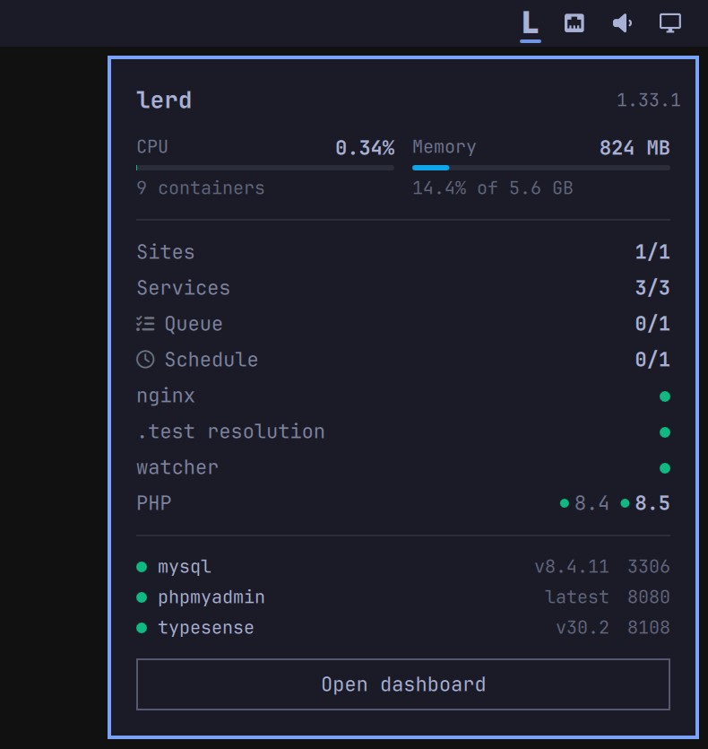

# lerd Glance

> Your [lerd](https://lerd.sh) environment at a glance in the Omarchy Quattro
> bar. Sites, services, workers and resources without opening the dashboard.

[](LICENSE)
[](https://omarchy.org)
[](https://lerd.sh)
[](https://reddit.com/r/lerd)
[](https://discord.gg/5JK54s7xCC)



lerd Glance puts the state of your local PHP environment in the bar you are
already looking at. A healthy environment stays quiet, a broken one is obvious
from across the screen, a section with nothing in it is not drawn at all, and
the whole thing talks to nothing but the lerd already running on your machine.

## Features

### In the bar

- 🔴 **Quiet until it matters.** The bar carries lerd's mark on its own and gains a coloured dot only when something is wrong, yellow for a warning and red when nginx is down.

- 🖱️ **Hover for the short version.** Site and service counts, CPU, memory, and the list of problems, without opening anything.

- 🌗 **Monochrome and theme-aware.** The mark takes the bar's foreground and the panel takes the popup surface's, so both look right in every Omarchy theme, light or dark.

### In the panel

- 🔀 **Two views, one toggle.** A dense table (400px, every row 20px, htop style) or three columns (720px: sites · services · environment and workers). The icon at the top right switches between them, `v` does the same, and the choice is remembered in the bar's settings.

- 📊 **Resources.** Total CPU and memory across every lerd container, drawn as the same meters the dashboard uses, with the share of host memory and the container count.

- 🌐 **Sites and services.** How many of each are running, with paused sites left out of the count instead of quietly failing it — and the sites themselves listed with their PHP version, state and the workers they declare.

- ⚙️ **Workers by type.** A counter and a glyph per kind: queue, horizon, schedule, reverb, Stripe, and framework workers such as Vite.

- 🩺 **Environment health.** nginx, `.test` resolution and the file watcher, plus every installed PHP version with the default in bold.

- 🗄️ **Services at a glance.** Shared services with status, version and port, then the per-site worker units gathered under their site instead of mixed into one long list. A unit lerd reports twice is shown once.

- ⚠️ **Needs attention.** What is actually wrong, in plain words, and nothing at all when nothing is. A worker only counts as unhealthy when lerd itself says so, so a queue worker you never started is not reported as broken.

### Actions

- 🖱️ **On the row it belongs to.** Hover a row and its verbs appear as icons on the right, in place of the detail they cover: pause, resume or restart a site; start or stop a worker; start, stop or restart a service. The icon spins while lerd works and turns red with the refusal as its tooltip when lerd says no, so a failure lands on the row that caused it.

- 🩺 **Heal.** Offered only when lerd itself reports unhealthy workers, because it is lerd's own answer to exactly that.

- 🌐 **Open a site.** Clicking a site row opens the site itself, over https when it has a certificate and http when it does not.

- 🚀 **Open dashboard.** Hands off to `xdg-open http://lerd.localhost`.

- 🧹 **Clean up.** Appears only when lerd reports reclaimable disk space, shows how much, asks before it runs — the reclaim removes images from the host, including dangling ones other workloads left behind — and then lets lerd apply its own freshly inspected plan rather than calling podman itself.

## Requirements

Omarchy Quattro, and lerd running on the same machine. Nothing else, and no
configuration.

## Install

```sh
omarchy plugin add https://github.com/lerd-env/lerd-omarchy-glance.git --enable
```

## Usage

Click the widget to open or close the panel, press Escape to close it. Clicking
also forces a refresh; otherwise it polls every 30 seconds, and every 5 seconds
while the panel is open.

## Configure

```sh
omarchy bar move sh.lerd.glance --section right
```

The plugin reads `http://127.0.0.1:7073`, the address lerd's dashboard already
listens on, and says so plainly when lerd is not running. If you serve lerd on
another port, change the `endpoint` property at the top of `BarWidget.qml`.

## Privacy and permissions

Everything happens over loopback to the lerd instance already running as your
user. The plugin sends no telemetry and contacts no third party. It changes
nothing until you press something: the verbs on a row, heal and cleanup, all of
which are requests to lerd's own API rather than anything the plugin does
itself. The only process it ever starts is the `xdg-open` behind Open dashboard
and a site row.

## Development

All the logic that turns lerd's API into what you see lives in `Model.js`, and
the rules for which request a row turns into live in `Actions.js`. Both are
free of QML imports, so they run under node while the shell loads the same
files:

```sh
node --test test/*.mjs
```

`BarWidget.qml` owns the polling and hands a finished summary to `Panel.qml`,
which draws the header and the two buttons and loads one of the views:
`DenseView.qml` (the table) or `ColumnsView.qml` (the three columns).
`BarWidget.qml` is also the only place that speaks HTTP: the views call
`run()` with a request `Actions.js` built, and bind their icons to the state
it reports back. `Meter.qml`, `StatRow.qml`, `StatusDot.qml`,
`SectionTitle.qml`, `WorkerGlyph.qml`, `Flag.qml`, `ActionIcon.qml`,
`ActionRow.qml` and `Mark.qml` are the pieces they are drawn from, and `Theme.js` holds the state palette, which follows the lerd
dashboard's own colours, plus the few glyphs the chrome needs.

Validate a change the way the shell does before opening a pull request:

```sh
omarchy plugin validate ~/.config/omarchy/plugins/sh.lerd.glance
qmllint -I "$OMARCHY_PATH/shell" ~/.config/omarchy/plugins/sh.lerd.glance/*.qml
```

## Remove

```sh
omarchy plugin remove sh.lerd.glance
```

## License

MIT
